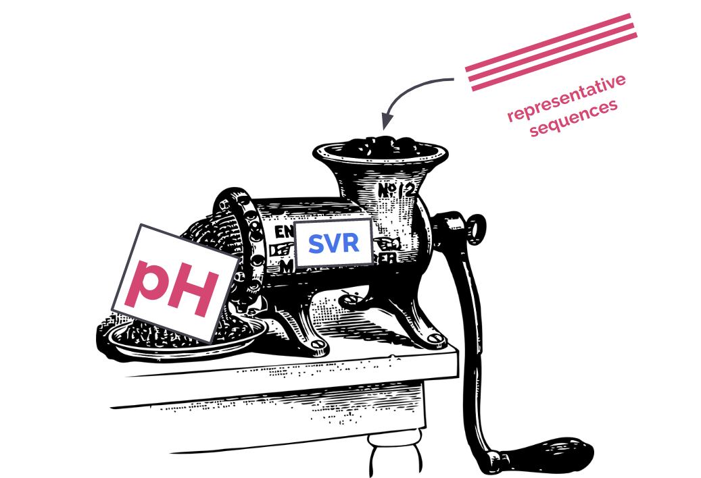

# Krebs Bicycle

We are a team of five bachelor's and master's degree bioinformatics students from Jagiellonian University, Kraków, Poland. We have no idea what we're doing, but we're trying our best.

## Project Description

See our final presentation [HERE](https://docs.google.com/presentation/d/1dAQVwbpZYm-8CkUkZDdlV3-0VTJlsqcsueiwaUeuleQ/edit?usp=sharing).

We build a regression model for prediction of optimal pH of a protein from its raw sequence. We managed to achieve 0.57 MSE and 0.73 Spearman Rank Correlation on the test dataset.

It utilizes an SVR operating on amino acid frequencies and calculated physicochemical properties (length, molecular weight, pI, hydrophobicity and Ikai aliphatic index)calculated with ['Peptides' R package](https://cran.r-project.org/web/packages/Peptides/Peptides.pdf). Because SVRs are hard to scale to 100,000 samples we had in our training dataset, we used CD-HIT to select 28,341 representative proteins for clusters defined by 90% identity thresholds. 

Besides those features, we also tested some other: dipeptide and tripeptide frequencies, frequencies of gapped nucleotides, and motifs found with MEME to be characteristic to proteins from acidic/alkaline environments. However, we found the combination of amino acid frequencies and peptide properties to be working the best.

[GitHub repo](https://github.com/Rusiek/optimal-ph) (It's a mess, enter at your own risk!)

## Team members
- Jan Havránek
- Michał Pawliszko
- Kinga Żarska
- Maks Necki
- Szymon Rusiecki

## Scoreboard
You can track the performance of our predictor in the [challenge scoreboard](https://biolib.com/biohackathon/optimal-ph-scoreboard/).
